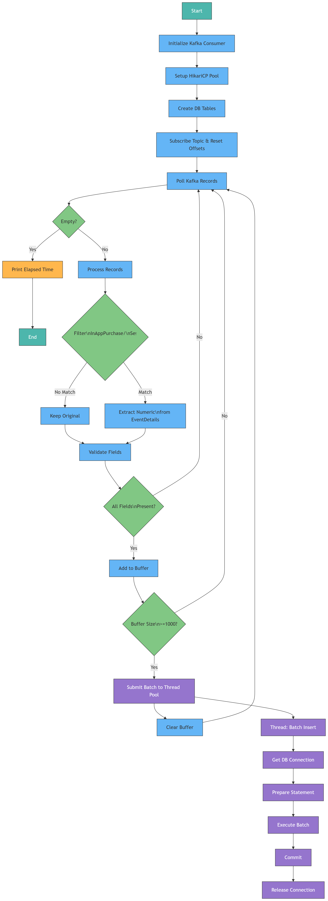
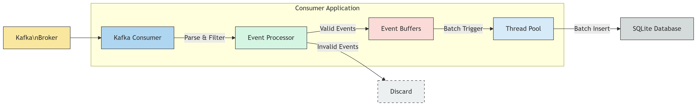

以下是 [ConsumerMultiThread.java](file://C:\Users\admin\IdeaProjects\featurestore-for-joycastle\src\main\java\com\example\featurestoreforjoycastle\ConsumerMultiThread.java) 文件的详细文档说明：


## 程序流程图



---

## 📄类名
[ConsumerMultiThread](file://C:\Users\admin\IdeaProjects\featurestore-for-joycastle\src\main\java\com\example\featurestoreforjoycastle\ConsumerMultiThread.java#L23-L201)

---

## 🧩包名
`com.example.featurestoreforjoycastle`

---

## 📦功能概述

该类是一个多线程 Kafka 消费者程序，主要负责从 Kafka 的 `game_events` 主题中消费数据，过滤、解析事件内容，并将指定类型的事件批量写入 SQLite 数据库中。

---

## 📚依赖库

- **Kafka Client**：用于连接 Kafka 并消费消息；
- **FastJSON**：用于解析 Kafka 中的消息为 Java Map；
- **HikariCP**：数据库连接池，用于高效管理 SQLite 连接；
- **SQLite JDBC**：用于操作 SQLite 数据库；
- **Java 多线程工具类（ExecutorService）**：实现多线程并发处理插入任务。

---

## 🔧关键常量定义

| 常量名 | 类型 | 描述 |
|--------|------|------|
| [GROUPID](file://C:\Users\admin\IdeaProjects\featurestore-for-joycastle\src\main\java\com\example\featurestoreforjoycastle\ConsumerMultiThread.java#L24-L24) | `String` | Kafka 消费者组 ID |
| [EVENT_TYPES](file://C:\Users\admin\IdeaProjects\featurestore-for-joycastle\src\main\java\com\example\featurestoreforjoycastle\ConsumerMultiThread.java#L25-L25) | `Set<String>` | 需要处理的事件类型集合（如 `InAppPurchase`, `SessionEnd`） |
| [eventFields](file://C:\Users\admin\IdeaProjects\featurestore-for-joycastle\src\main\java\com\example\featurestoreforjoycastle\ConsumerMultiThread.java#L26-L33) | `List<String>` | 事件中应包含的字段名称列表 |
| [BATCH_SIZE](file://C:\Users\admin\IdeaProjects\featurestore-for-joycastle\src\main\java\com\example\featurestoreforjoycastle\ConsumerMultiThread.java#L34-L34) | `int` | 批量插入数据库的数据条数阈值 |
| [buffers](file://C:\Users\admin\IdeaProjects\featurestore-for-joycastle\src\main\java\com\example\featurestoreforjoycastle\ConsumerMultiThread.java#L35-L35) | `Map<String, List<List<Object>>>` | 按事件类型缓存待插入数据的缓冲区 |
| [executorService](file://C:\Users\admin\IdeaProjects\featurestore-for-joycastle\src\main\java\com\example\featurestoreforjoycastle\ConsumerMultiThread.java#L38-L38) | `ExecutorService` | 固定大小为8的线程池，用于异步执行插入任务 |
| [dataSource](file://C:\Users\admin\IdeaProjects\featurestore-for-joycastle\src\main\java\com\example\featurestoreforjoycastle\ConsumerMultiThread.java#L40-L40) | `HikariDataSource` | 全局共享的数据库连接池 |

---

## ⚙️主方法 [main(String[] args)](file://C:\Users\admin\IdeaProjects\featurestore-for-joycastle\src\main\java\com\example\featurestoreforjoycastle\ConsumerMultiThread.java#L42-L159)

### 流程概览

1. **初始化 Kafka 消费者配置**
2. **初始化 SQLite 连接池（HikariCP）**
3. **创建事件对应的数据库表**
4. **手动设置消费者偏移量为最早**
5. **持续拉取消息并处理**
6. **满足条件后提交到线程池进行异步批量插入**

---

## 📥 Kafka 消费逻辑

### Kafka 消费者配置参数

| 参数 | 值 | 说明 |
|------|----|------|
| `bootstrap.servers` | `localhost:9092` | Kafka 集群地址 |
| `group.id` | `codingce_consumer_a` | 消费者组 ID |
| `enable.auto.commit` | `true` | 启用自动提交偏移量 |
| `auto.offset.reset` | `earliest` | 从最早位置开始消费 |
| `max.poll.records` | `1000` | 单次 poll 最大获取记录数 |
| `session.timeout.ms` | `30000` | 心跳超时时间 |
| `key.deserializer` / `value.deserializer` | `StringDeserializer` | 使用字符串反序列化器 |

---

## 🗂️数据库建表逻辑

### 表结构定义

每个事件类型（如 `"EventID"`）都会生成一张名为 `dwd_EventID` 的表，字段如下：

```sql
CREATE TABLE IF NOT EXISTS dwd_<eventType> (
    EventID TEXT,
    PlayerID TEXT,
    EventTimestamp TEXT,
    EventType TEXT,
    EventDetails TEXT,
    DeviceType TEXT,
    Location TEXT
);
```


---

## 📝数据处理流程

### 步骤详解：

1. **消费 Kafka 消息**
    - 使用 `poll(1000)` 获取一批记录；
    - 若连续 1 秒无新数据，则输出耗时并退出程序。

2. **解析 JSON 消息**
    - 使用 `FastJSON.parseObject()` 将每条消息转换为 `Map`。

3. **事件类型过滤**
    - 只处理 `EVENT_TYPES` 中声明的事件类型。

4. **提取数值信息**
    - 使用正则表达式 `(\\d+\\.\\d+|\\d+)` 提取 `EventDetails` 中的数字（如金额或停留时间）；
    - 替换原始 `EventDetails` 字段为浮点数。

5. **字段完整性检查**
    - 如果消息缺少任何 `eventFields` 字段，则跳过此条消息。

6. **数据缓存与批量插入**
    - 按字段顺序构建数据行；
    - 缓存至 `buffers`；
    - 当缓存数量达到 `BATCH_SIZE`，触发异步插入任务。

---

## 🧵多线程插入逻辑

### 异步插入方法：`insertBatch(List<List<Object>>, String eventType)`

#### 功能：
将缓存中的数据批量插入到对应的 SQLite 表中。

#### 实现细节：

- 每个线程从连接池获取独立连接；
- 使用 `PreparedStatement` 执行批量插入；
- 开启事务控制；
- 出错时回滚事务；
- 成功插入后提交事务。

#### SQL 示例：

```sql
INSERT INTO dwd_InAppPurchase (
    EventID, PlayerID, EventTimestamp, EventType, EventDetails, DeviceType, Location
) VALUES (?, ?, ?, ?, ?, ?, ?)
```


---

## 🧪性能优化措施

| 技术 | 说明 |
|------|------|
| **连接池（HikariCP）** | 避免频繁建立和释放数据库连接 |
| **线程池（ExecutorService）** | 利用多线程提高插入效率 |
| **批量插入（PreparedStatement + addBatch）** | 减少单次数据库交互次数 |
| **事务控制** | 确保插入原子性，提升稳定性 |

---

## 🧹资源清理

- 使用 try-with-resources 确保所有数据库连接正确关闭；
- 在 finally 块中调用 `executorService.shutdown()` 关闭线程池。

---

## ✅异常处理策略

- **SQL 异常捕获**：在建表和插入过程中均使用 try-catch 捕获并打印异常；
- **事务回滚**：插入失败时自动回滚事务；
- **数据跳过机制**：若字段缺失或匹配失败，直接跳过当前记录。

---

## 📊性能指标示例

- 每次 poll 最大拉取 1000 条消息；
- 缓冲满 1000 条后才插入；
- 多线程并发处理插入任务；
- 单次空 poll 超时后输出总运行时间（如 `Elapsed time: 5780 milliseconds`）。

---

## 📎总结

该程序实现了以下完整流程：

> Kafka → 消息消费 → JSON 解析 → 事件过滤 → 数值提取 → 数据缓存 → 多线程批量插入 SQLite

适用于日志收集、游戏数据分析等场景。#   f e a t u r e s t o r e - f o r - j o y c a s t l e - j a v a 
 
 
